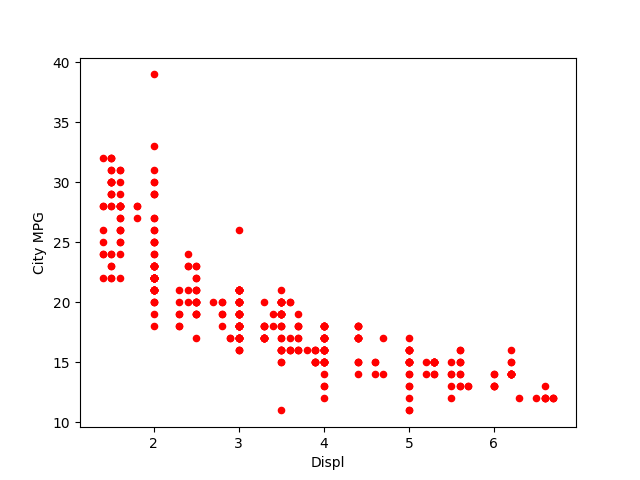
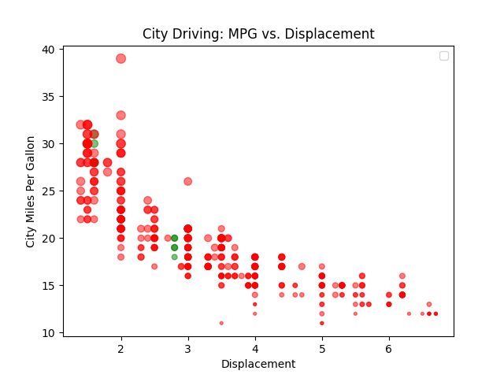
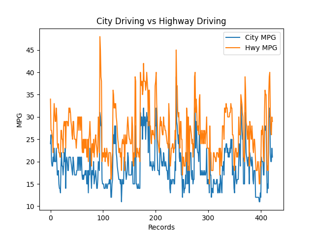

# Intermediate Python Course - UCSD

## Lab 8

**NOTE on extra credit:** I could not get the legend to show the labels on the `City Driving: MPG vs. Displacement` graph, despite trying for longer than I should have. It drove me slightly mad. 

I tried setting the x and y labels inline in the plot.scatter definition as well as here as well several of other ways. Decided to let this bit of extra credit go for the sake of my sanity.

If you can shed any light on why this wouldn't work it would be appreciated.

### How to Run

`cd` into project directory and run: `export PYTHONPATH="$PWD"`

To run any [program]:

`python3 [program]`

e.g.

`python3 p2_visualise_data.py`

### Output of program

#### p1_etl_dataframes.py

See `car_data.csv`

#### p2_visualise_data.py

